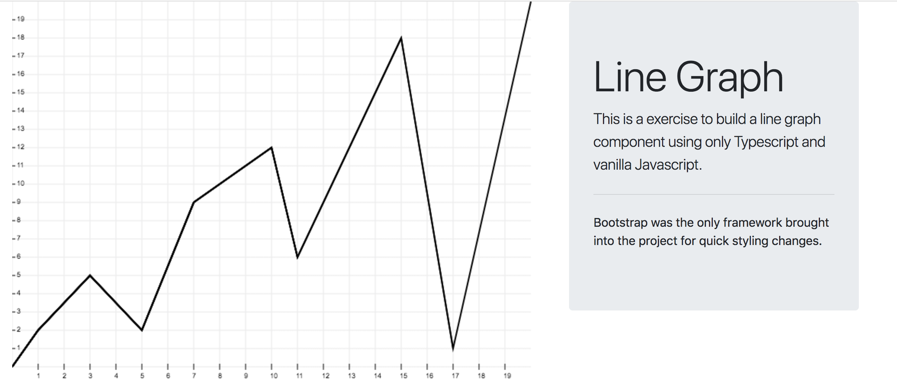
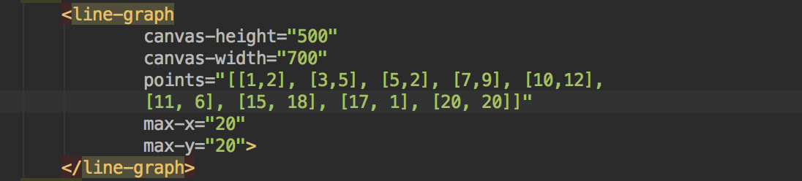

# Line Graph Exerise
##### By David Spires

### How To Run
```sh
$ git clone https://github.com/spiresd55/code-playground.git
$ cd ./code-playground/exercises/line-graph
$ npm install
$ npm install typescript -g
$ npm install webpack-cli -g
$ npm run start:dev
```
After following the above directions the webpack-dev-server should be running on localhost:8080
It should look something like below.




### How to change input
Unfortunately I did not get the chance to enable user input in the application.
It is something that can be easily added with some more time. 
To change the inputs of the app, go to index.html and change the properties 
on the html element line-graph.



Line Graph Attributes
- **canvas-height:** Total height of the HTML canvas
- **canvas-width:** Total width of the HTML canvas 
- **points:** Coordinate Points for the graph
- **max-x:** The maximum value for X in a coordinate 
- **max-y:** The maximum value for Y in a coordinate 

### Assumptions I Made 
- Inputs are positive coordinates only. 
- That user input was not a requirement, but a nice to have.
- This was a test to see my Javascript/Typescript skills. 
Due to this I restricted myself from using a component library such
as React or Angular. I can implement this code in either framework.

### If I had more time
- Sass for css
- User Input for form and settings
- Code magnification
- Tests and Test Coverage with Jasmine or Mocha.
- User Form Validations for user input. 
- Error handling for out of bound coordinates. 
- User error notifications when something goes wrong

### Quick Notes about the code.
- The entry point for the app is index.ts
- I built the graph using interfaces, abstract classes, 
and the customElement library.
- I built the graph in a shadow-dom component. Meaning that the DOM within 
the line-graph will never clutter the global namespace
 
### Closing remarks

I hope this is a good enough sample of my code. If you would like to see more before
making a decision. I am willing to implement some of the other features I mentioned.
